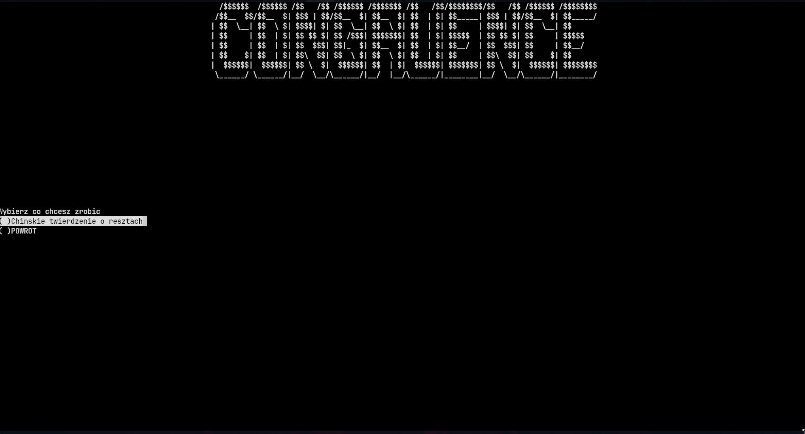
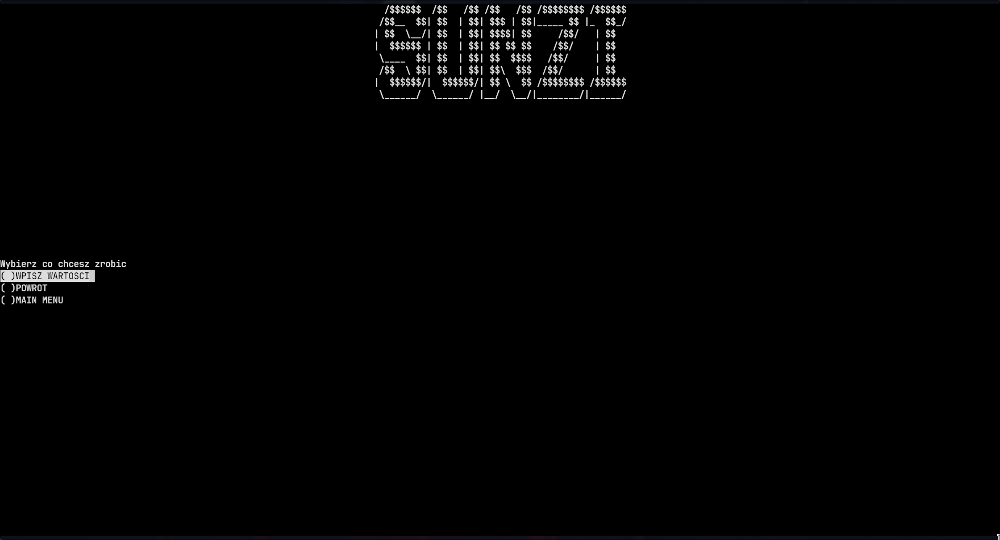

# Chińskie twierdzenie o resztach

## MENU na obliczenia z kongruencji

## MENU z Chińskim twierdzeniam o resztach

## Obliczenia z zadania

### Informacje
Algorytm działa tylko dla modułów względnie pierwszych. Można w przyszłości dodać możliwość,
aby algorytm rozkładał moduły na czynniki pierwsze.
